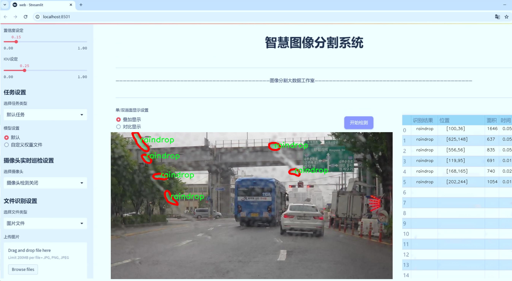
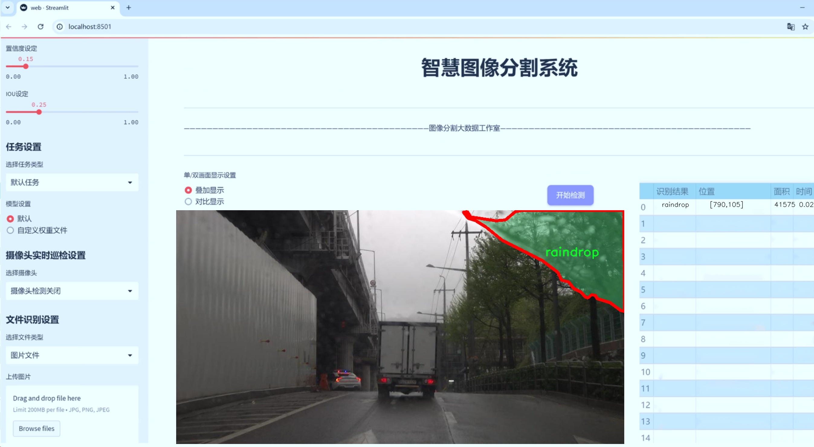
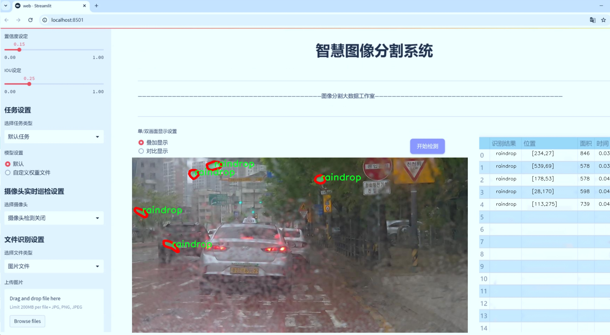
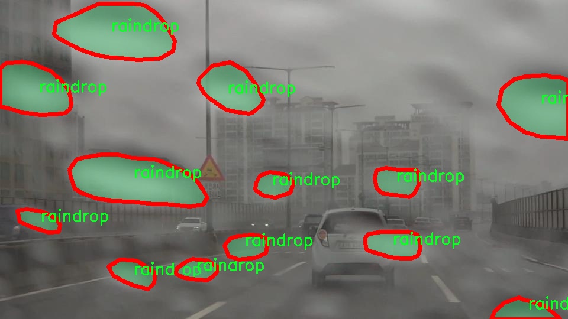
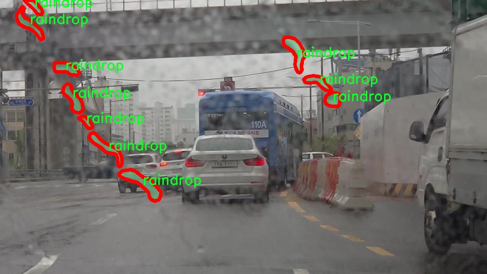
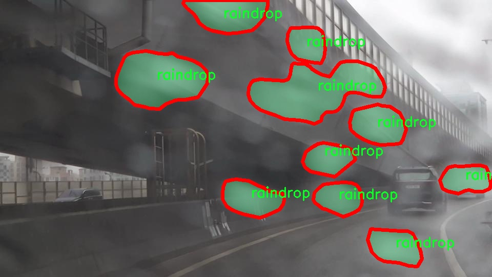
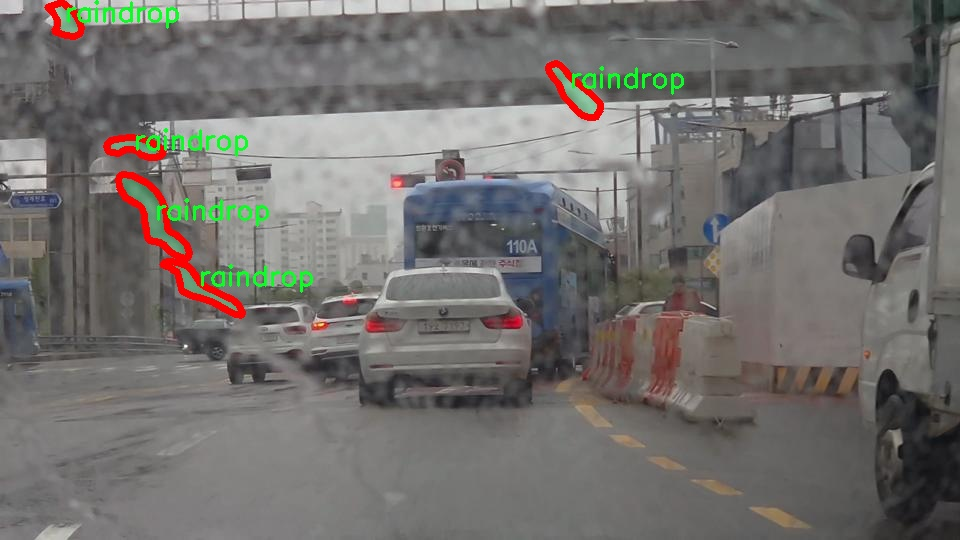

# 雨天前车窗雨滴等障碍物图像系统源码＆数据集分享
 [yolov8-seg-C2f-RFCBAMConv＆yolov8-seg-C2f-REPVGGOREPA等50+全套改进创新点发刊_一键训练教程_Web前端展示]

### 1.研究背景与意义

项目参考[ILSVRC ImageNet Large Scale Visual Recognition Challenge](https://gitee.com/YOLOv8_YOLOv11_Segmentation_Studio/projects)

项目来源[AAAI Global Al lnnovation Contest](https://kdocs.cn/l/cszuIiCKVNis)

研究背景与意义

随着智能交通系统和自动驾驶技术的迅速发展，环境因素对车辆安全行驶的影响日益受到重视。尤其是在恶劣天气条件下，如雨天，前车窗上的雨滴等障碍物不仅会影响驾驶员的视线，还可能导致传感器的误判，从而影响自动驾驶系统的决策能力。因此，针对雨天条件下前车窗雨滴等障碍物的检测与识别，成为了智能交通领域亟待解决的技术难题。

在此背景下，YOLO（You Only Look Once）系列目标检测算法因其高效性和实时性，逐渐成为研究者们的关注焦点。YOLOv8作为该系列的最新版本，具备了更强的特征提取能力和更快的推理速度，适合在复杂环境中进行实时目标检测。然而，传统的YOLOv8模型在处理雨天条件下的图像时，仍然面临着许多挑战。雨滴的形状、大小和分布具有高度的随机性，且在图像中与其他障碍物（如泥土、树叶等）存在一定的相似性，这使得模型在准确识别雨滴时可能出现误判。因此，改进YOLOv8以提高其在雨天前车窗图像中对雨滴及其他障碍物的检测能力，具有重要的研究意义。

本研究将基于capstone-design-dataset数据集进行深入分析。该数据集包含1200张图像，涵盖了8个类别，包括雨滴、泥土、树叶等多种障碍物。这一多样化的类别设置为模型的训练提供了丰富的样本，能够有效提升模型在复杂环境下的泛化能力。通过对数据集的深入挖掘与分析，研究者可以识别出不同障碍物的特征，从而为改进YOLOv8提供数据支持。此外，实例分割技术的引入，将使得模型不仅能够识别障碍物的存在，还能精确到每个障碍物的轮廓，为后续的路径规划和决策提供更为详尽的信息。

本研究的意义不仅在于技术上的创新，更在于其对实际应用的推动。通过改进YOLOv8，能够有效提升雨天驾驶的安全性，减少因视线受阻而导致的交通事故。同时，该研究也为未来的智能交通系统提供了重要的理论基础和实践经验，推动了自动驾驶技术在复杂天气条件下的应用。此外，研究成果还可为其他领域的图像处理提供借鉴，如监控系统、无人机视觉等，具有广泛的应用前景。

综上所述，基于改进YOLOv8的雨天前车窗雨滴等障碍物图像系统的研究，不仅具有重要的学术价值，也对提升智能交通系统的安全性和可靠性具有深远的现实意义。通过对数据集的有效利用和模型的优化，期望能够为未来的智能驾驶技术发展提供新的思路和解决方案。

### 2.图片演示







##### 注意：由于此博客编辑较早，上面“2.图片演示”和“3.视频演示”展示的系统图片或者视频可能为老版本，新版本在老版本的基础上升级如下：（实际效果以升级的新版本为准）

  （1）适配了YOLOV8的“目标检测”模型和“实例分割”模型，通过加载相应的权重（.pt）文件即可自适应加载模型。

  （2）支持“图片识别”、“视频识别”、“摄像头实时识别”三种识别模式。

  （3）支持“图片识别”、“视频识别”、“摄像头实时识别”三种识别结果保存导出，解决手动导出（容易卡顿出现爆内存）存在的问题，识别完自动保存结果并导出到tempDir中。

  （4）支持Web前端系统中的标题、背景图等自定义修改，后面提供修改教程。

  另外本项目提供训练的数据集和训练教程,暂不提供权重文件（best.pt）,需要您按照教程进行训练后实现图片演示和Web前端界面演示的效果。

### 3.视频演示

[3.1 视频演示](https://www.bilibili.com/video/BV17Fy8YhESz/)

### 4.数据集信息展示

##### 4.1 本项目数据集详细数据（类别数＆类别名）

nc: 1
names: ['raindrop']


##### 4.2 本项目数据集信息介绍

数据集信息展示

在本研究中，我们使用了名为“capstone-design-dataset”的数据集，旨在训练和改进YOLOv8-seg模型，以提高其在雨天条件下对前车窗雨滴等障碍物的检测能力。该数据集专注于一个特定的类别，即“raindrop”，这使得其在处理与雨滴相关的图像识别任务时具有高度的针对性和有效性。通过聚焦于单一类别，研究者能够深入分析和优化模型在特定场景下的表现，从而实现更高的准确率和更低的误报率。

“capstone-design-dataset”数据集的构建过程充分考虑了雨天驾驶环境的复杂性，特别是前车窗上雨滴的形态、大小和分布特征。数据集中包含了大量在不同雨量、不同光照条件下拍摄的图像，这些图像不仅展示了雨滴的多样性，还涵盖了各种可能的干扰因素，如车窗的污垢、反射光以及其他天气条件对图像质量的影响。这种多样性确保了模型在训练过程中能够接触到丰富的样本，从而提高其泛化能力，使其在实际应用中能够更好地适应各种变化的环境。

在数据集的标注过程中，研究团队采用了精确的标注技术，以确保每个图像中的雨滴都被准确地识别和标记。这一过程不仅提高了数据集的质量，也为后续的模型训练提供了可靠的基础。通过对雨滴的精确标注，YOLOv8-seg模型能够学习到雨滴在图像中的特征，包括其形状、颜色和运动轨迹等，从而在实际应用中实现更为精准的检测和分割。

此外，数据集的设计还考虑到了实际应用中的实时性需求。在雨天驾驶中，快速、准确地识别前车窗上的雨滴对于提高驾驶安全性至关重要。因此，数据集中包含的图像不仅数量庞大，而且涵盖了多种动态场景，确保模型在处理实时视频流时能够保持高效的响应速度。这种设计理念为模型的实用性提供了强有力的支持，使其能够在复杂的驾驶环境中发挥出色的性能。

总之，“capstone-design-dataset”作为本研究的核心数据来源，通过对雨滴这一特定类别的深入挖掘和分析，为YOLOv8-seg模型的训练提供了坚实的基础。数据集的丰富性和多样性，不仅为模型的学习提供了充分的样本，也为后续的研究和应用奠定了良好的基础。通过对该数据集的有效利用，我们期望能够显著提升模型在雨天驾驶场景中的表现，从而为自动驾驶技术的发展贡献一份力量。










### 5.全套项目环境部署视频教程（零基础手把手教学）

[5.1 环境部署教程链接（零基础手把手教学）](https://www.bilibili.com/video/BV1jG4Ve4E9t/?vd_source=bc9aec86d164b67a7004b996143742dc)


[5.2 安装Python虚拟环境创建和依赖库安装视频教程链接（零基础手把手教学）](https://www.bilibili.com/video/BV1nA4VeYEze/?vd_source=bc9aec86d164b67a7004b996143742dc)

### 6.手把手YOLOV8-seg训练视频教程（零基础小白有手就能学会）

[6.1 手把手YOLOV8-seg训练视频教程（零基础小白有手就能学会）](https://www.bilibili.com/video/BV1cA4VeYETe/?vd_source=bc9aec86d164b67a7004b996143742dc)


按照上面的训练视频教程链接加载项目提供的数据集，运行train.py即可开始训练



     Epoch   gpu_mem       box       obj       cls    labels  img_size
     1/200     0G   0.01576   0.01955  0.007536        22      1280: 100%|██████████| 849/849 [14:42<00:00,  1.04s/it]
               Class     Images     Labels          P          R     mAP@.5 mAP@.5:.95: 100%|██████████| 213/213 [01:14<00:00,  2.87it/s]
                 all       3395      17314      0.994      0.957      0.0957      0.0843

     Epoch   gpu_mem       box       obj       cls    labels  img_size
     2/200     0G   0.01578   0.01923  0.007006        22      1280: 100%|██████████| 849/849 [14:44<00:00,  1.04s/it]
               Class     Images     Labels          P          R     mAP@.5 mAP@.5:.95: 100%|██████████| 213/213 [01:12<00:00,  2.95it/s]
                 all       3395      17314      0.996      0.956      0.0957      0.0845

     Epoch   gpu_mem       box       obj       cls    labels  img_size
     3/200     0G   0.01561    0.0191  0.006895        27      1280: 100%|██████████| 849/849 [10:56<00:00,  1.29it/s]
               Class     Images     Labels          P          R     mAP@.5 mAP@.5:.95: 100%|███████   | 187/213 [00:52<00:00,  4.04it/s]
                 all       3395      17314      0.996      0.957      0.0957      0.0845


### 7.50+种全套YOLOV8-seg创新点代码加载调参视频教程（一键加载写好的改进模型的配置文件）

[7.1 50+种全套YOLOV8-seg创新点代码加载调参视频教程（一键加载写好的改进模型的配置文件）](https://www.bilibili.com/video/BV1Hw4VePEXv/?vd_source=bc9aec86d164b67a7004b996143742dc)

### 8.YOLOV8-seg图像分割算法原理

原始YOLOv8-seg算法原理

YOLOv8-seg是YOLO系列中最新的一个重要进展，旨在实现高效的目标检测与分割任务。该算法由Ultralytics团队于2023年发布，基于YOLOv5的架构，结合了过去两年间在目标检测领域的多项创新和改进，形成了一个更加精确且高效的模型。YOLOv8-seg不仅继承了YOLO系列的优良传统，还在模型结构、训练策略和损失函数等多个方面进行了优化，旨在提升模型的鲁棒性和准确性。

在YOLOv8-seg的设计中，输入端的处理尤为重要。与传统的YOLO模型相比，YOLOv8-seg在数据增强策略上进行了调整，尤其是对Mosaic数据增强的使用进行了反思。虽然Mosaic增强能够提高模型的泛化能力，但在某些情况下，它可能会导致数据分布的失真，从而影响模型的学习效果。因此，YOLOv8-seg在训练的最后10个epoch中停止使用Mosaic增强，以确保模型能够更好地学习到真实数据的特征。这一策略的调整，体现了YOLOv8-seg在数据处理上的细致考量，旨在最大限度地保留数据的真实信息。

在网络结构方面，YOLOv8-seg对主干网络进行了重要的改进。具体来说，YOLOv8-seg将原有的C3模块替换为C2f模块。C2f模块的设计灵感来源于YOLOv7中的ELAN结构，通过引入更多的跳层连接，增强了梯度流的丰富性。这种设计不仅提升了特征提取的能力，还在一定程度上实现了模型的轻量化，使得YOLOv8-seg在保持高效性的同时，能够处理更复杂的特征。此外，YOLOv8-seg仍然保留了SPPF（Spatial Pyramid Pooling Fusion）模块，以提高模型的计算速度，同时确保在特征提取过程中不损失重要信息。

在颈部网络的设计上，YOLOv8-seg采用了PAN-FPN（Path Aggregation Network with Feature Pyramid Network）结构，这一结构的引入进一步增强了模型对不同尺度对象的特征融合能力。通过多尺度特征的有效融合，YOLOv8-seg能够更好地应对复杂场景下的目标检测与分割任务，确保在不同尺度下都能保持较高的检测精度。

头部网络的设计是YOLOv8-seg的一大亮点。与传统的耦合头不同，YOLOv8-seg采用了解耦头的结构，将分类和定位任务分开处理。这种设计使得模型在处理分类任务时，能够更专注于特征图中的相似性分析，而在定位任务中，则更关注边界框与真实框之间的关系。这种任务的解耦不仅提高了模型的收敛速度，还提升了预测的精度。此外，YOLOv8-seg引入了无锚框（Anchor-Free）检测机制，直接预测目标的中心位置，并通过任务对齐学习（Task Alignment Learning，TAL）来优化正负样本的区分。这一创新使得模型在处理复杂场景时，能够更有效地识别和定位目标。

在损失函数的设计上，YOLOv8-seg结合了分类分数和IOU（Intersection over Union）的高次幂乘积，以衡量任务对齐的程度。这一策略确保了模型在分类和定位两个方面都能获得良好的性能，进而提升了整体的检测效果。具体而言，分类分支采用了二元交叉熵损失（Binary Cross Entropy Loss），而回归分支则结合了分布焦点损失（Distribution Focal Loss）和完全交并比损失（Complete Intersection over Union Loss），以提升边界框预测的精准性。

YOLOv8-seg在模型性能方面的表现也颇为出色。通过对比实验，YOLOv8-seg在COCO数据集上的mAP（mean Average Precision）指标显示出显著的提升，尤其是在不同尺寸的模型中，YOLOv8-seg在参数量没有显著增加的情况下，取得了更高的精度和更快的推理速度。这一成果不仅验证了YOLOv8-seg在目标检测领域的优越性，也为后续的研究和应用提供了坚实的基础。

综上所述，YOLOv8-seg通过对数据增强策略的优化、网络结构的创新、任务解耦的设计以及损失函数的改进，成功实现了高效的目标检测与分割任务。其在准确性和实时性上的双重优势，使得YOLOv8-seg在实际应用中展现出广泛的前景，尤其是在需要快速响应和高精度检测的场景中，具有重要的应用价值。随着YOLOv8-seg的不断发展和完善，未来在智能监控、自动驾驶、机器人视觉等领域的应用将更加广泛，为相关技术的进步提供强有力的支持。


### 9.系统功能展示（检测对象为举例，实际内容以本项目数据集为准）

图9.1.系统支持检测结果表格显示

  图9.2.系统支持置信度和IOU阈值手动调节

  图9.3.系统支持自定义加载权重文件best.pt(需要你通过步骤5中训练获得)

  图9.4.系统支持摄像头实时识别

  图9.5.系统支持图片识别

  图9.6.系统支持视频识别

  图9.7.系统支持识别结果文件自动保存

  图9.8.系统支持Excel导出检测结果数据


### 10.50+种全套YOLOV8-seg创新点原理讲解（非科班也可以轻松写刊发刊，V11版本正在科研待更新）

#### 10.1 由于篇幅限制，每个创新点的具体原理讲解就不一一展开，具体见下列网址中的创新点对应子项目的技术原理博客网址【Blog】：


[10.1 50+种全套YOLOV8-seg创新点原理讲解链接](https://gitee.com/qunmasj/good)

#### 10.2 部分改进模块原理讲解(完整的改进原理见上图和技术博客链接)【如果此小节的图加载失败可以通过CSDN或者Github搜索该博客的标题访问原始博客，原始博客图片显示正常】

### Gold-YOLO


#### Preliminaries
YOLO系列的中间层结构采用了传统的FPN结构，其中包含多个分支用于多尺度特征融合。然而，它只充分融合来自相邻级别的特征，对于其他层次的信息只能间接地进行“递归”获取。

传统的FPN结构在信息传输过程中存在丢失大量信息的问题。这是因为层之间的信息交互仅限于中间层选择的信息，未被选择的信息在传输过程中被丢弃。这种情况导致某个Level的信息只能充分辅助相邻层，而对其他全局层的帮助较弱。因此，整体上信息融合的有效性可能受到限制。
为了避免在传输过程中丢失信息，本文采用了一种新颖的“聚集和分发”机制（GD），放弃了原始的递归方法。该机制使用一个统一的模块来收集和融合所有Level的信息，并将其分发到不同的Level。通过这种方式，作者不仅避免了传统FPN结构固有的信息丢失问题，还增强了中间层的部分信息融合能力，而且并没有显著增加延迟。


#### 低阶聚合和分发分支 Low-stage gather-and-distribute branch
从主干网络中选择输出的B2、B3、B4、B5特征进行融合，以获取保留小目标信息的高分辨率特征。


#### 高阶聚合和分发分支 High-stage gather-and-distribute branch
高级全局特征对齐模块（High-GD）将由低级全局特征对齐模块（Low-GD）生成的特征{P3, P4, P5}进行融合。


Transformer融合模块由多个堆叠的transformer组成，transformer块的数量为L。每个transformer块包括一个多头注意力块、一个前馈网络（FFN）和残差连接。采用与LeViT相同的设置来配置多头注意力块，使用16个通道作为键K和查询Q的头维度，32个通道作为值V的头维度。为了加速推理过程，将层归一化操作替换为批归一化，并将所有的GELU激活函数替换为ReLU。为了增强变换器块的局部连接，在两个1x1卷积层之间添加了一个深度卷积层。同时，将FFN的扩展因子设置为2，以在速度和计算成本之间取得平衡。


信息注入模块(Information injection module)： 高级全局特征对齐模块（High-GD）中的信息注入模块与低级全局特征对齐模块（Low-GD）中的相同。在高级阶段，局部特征（Flocal）等于Pi，因此公式如下所示：


#### 增强的跨层信息流动 Enhanced cross-layer information flow
为了进一步提升性能，从YOLOv6 中的PAFPN模块中得到启发，引入了Inject-LAF模块。该模块是注入模块的增强版，包括了一个轻量级相邻层融合（LAF）模块，该模块被添加到注入模块的输入位置。为了在速度和准确性之间取得平衡，设计了两个LAF模型：LAF低级模型和LAF高级模型，分别用于低级注入（合并相邻两层的特征）和高级注入（合并相邻一层的特征）。它们的结构如图5(b)所示。为了确保来自不同层级的特征图与目标大小对齐，在实现中的两个LAF模型仅使用了三个操作符：双线性插值（上采样过小的特征）、平均池化（下采样过大的特征）和1x1卷积（调整与目标通道不同的特征）。模型中的LAF模块与信息注入模块的结合有效地平衡了准确性和速度之间的关系。通过使用简化的操作，能够增加不同层级之间的信息流路径数量，从而提高性能而不显著增加延迟。


### 11.项目核心源码讲解（再也不用担心看不懂代码逻辑）

#### 11.1 ui.py

以下是对代码的核心部分进行保留和详细注释的版本：

```python
import sys
import subprocess

def run_script(script_path):
    """
    使用当前 Python 环境运行指定的脚本。

    Args:
        script_path (str): 要运行的脚本路径

    Returns:
        None
    """
    # 获取当前 Python 解释器的路径
    python_path = sys.executable

    # 构建运行命令，使用 streamlit 运行指定的脚本
    command = f'"{python_path}" -m streamlit run "{script_path}"'

    # 执行命令并等待其完成
    result = subprocess.run(command, shell=True)
    
    # 检查命令执行的返回码，非零表示出错
    if result.returncode != 0:
        print("脚本运行出错。")

# 主程序入口
if __name__ == "__main__":
    # 指定要运行的脚本路径
    script_path = "web.py"  # 这里可以直接指定脚本名称，假设在当前目录下

    # 调用函数运行脚本
    run_script(script_path)
```

### 代码注释说明：

1. **导入模块**：
   - `sys`：用于访问与 Python 解释器紧密相关的变量和函数。
   - `subprocess`：用于生成新的进程、连接到它们的输入/输出/错误管道，并获得它们的返回码。

2. **`run_script` 函数**：
   - 功能：接收一个脚本路径并在当前 Python 环境中运行该脚本。
   - 参数：`script_path` 是要运行的脚本的路径。
   - 过程：
     - 使用 `sys.executable` 获取当前 Python 解释器的路径。
     - 构建一个命令字符串，使用 `streamlit` 模块运行指定的脚本。
     - 使用 `subprocess.run` 执行该命令，并等待其完成。
     - 检查返回码，如果不为零，则输出错误信息。

3. **主程序入口**：
   - 使用 `if __name__ == "__main__":` 确保该代码块仅在直接运行该脚本时执行。
   - 指定要运行的脚本路径（这里假设脚本 `web.py` 在当前目录下）。
   - 调用 `run_script` 函数来执行指定的脚本。

这个程序文件 `ui.py` 是一个用于运行指定 Python 脚本的工具，特别是用于运行 Streamlit 应用的。首先，文件导入了几个必要的模块，包括 `sys`、`os` 和 `subprocess`，这些模块提供了与系统交互和执行外部命令的功能。此外，还导入了 `abs_path` 函数，该函数可能用于获取文件的绝对路径。

在 `run_script` 函数中，程序接受一个参数 `script_path`，这是要运行的脚本的路径。函数首先获取当前 Python 解释器的路径，这通过 `sys.executable` 实现。接着，构建一个命令字符串，该命令使用当前的 Python 解释器和 Streamlit 模块来运行指定的脚本。命令的格式是 `"{python_path}" -m streamlit run "{script_path}"`，其中 `{python_path}` 和 `{script_path}` 分别被当前 Python 解释器的路径和脚本路径替换。

然后，使用 `subprocess.run` 方法执行这个命令。`shell=True` 参数表示命令将在一个新的 shell 中执行。执行后，程序检查返回码，如果返回码不为零，表示脚本运行出错，则打印出错信息。

在文件的最后部分，使用 `if __name__ == "__main__":` 语句来确保当该文件作为主程序运行时，下面的代码才会被执行。在这里，指定了要运行的脚本路径为 `web.py`，并调用 `run_script` 函数来执行这个脚本。

总的来说，这个文件的主要功能是提供一个简单的接口，通过命令行运行一个 Streamlit 应用，方便用户在当前 Python 环境中启动和调试应用。

#### 11.2 ultralytics\utils\callbacks\comet.py

以下是经过简化并添加详细中文注释的核心代码部分：

```python
# 导入必要的库
from ultralytics.utils import LOGGER, RANK, SETTINGS, ops
import os
from pathlib import Path

# 检查是否在测试环境中运行
try:
    assert not TESTS_RUNNING  # 确保不是在pytest测试中
    assert SETTINGS['comet'] is True  # 确保Comet集成已启用
    import comet_ml  # 导入Comet库

    assert hasattr(comet_ml, '__version__')  # 确保comet_ml是有效的包

except (ImportError, AssertionError):
    comet_ml = None  # 如果导入失败，则将comet_ml设置为None

def _get_comet_mode():
    """获取环境变量中设置的Comet模式，默认为'online'。"""
    return os.getenv('COMET_MODE', 'online')

def _create_experiment(args):
    """创建Comet实验对象，确保在分布式训练中只在一个进程中创建。"""
    if RANK not in (-1, 0):  # 只在主进程中创建实验
        return
    try:
        comet_mode = _get_comet_mode()  # 获取Comet模式
        project_name = os.getenv('COMET_PROJECT_NAME', args.project)  # 获取项目名称
        experiment = comet_ml.Experiment(project_name=project_name) if comet_mode != 'offline' else comet_ml.OfflineExperiment(project_name=project_name)
        experiment.log_parameters(vars(args))  # 记录参数
    except Exception as e:
        LOGGER.warning(f'WARNING ⚠️ Comet未正确初始化，未记录此运行。{e}')

def _log_images(experiment, image_paths, curr_step, annotations=None):
    """将图像及其注释记录到Comet实验中。"""
    if annotations:
        for image_path, annotation in zip(image_paths, annotations):
            experiment.log_image(image_path, name=image_path.stem, step=curr_step, annotations=annotation)
    else:
        for image_path in image_paths:
            experiment.log_image(image_path, name=image_path.stem, step=curr_step)

def on_train_epoch_end(trainer):
    """在训练每个epoch结束时记录指标和保存批次图像。"""
    experiment = comet_ml.get_global_experiment()  # 获取当前的Comet实验
    if not experiment:
        return

    curr_epoch = trainer.epoch + 1  # 当前epoch
    curr_step = curr_epoch * (len(trainer.train_loader.dataset) // trainer.batch_size)  # 当前步骤

    experiment.log_metrics(trainer.label_loss_items(trainer.tloss, prefix='train'), step=curr_step, epoch=curr_epoch)  # 记录训练损失

def on_train_end(trainer):
    """在训练结束时执行操作。"""
    experiment = comet_ml.get_global_experiment()  # 获取当前的Comet实验
    if not experiment:
        return

    experiment.end()  # 结束实验

# 注册回调函数
callbacks = {
    'on_train_epoch_end': on_train_epoch_end,
    'on_train_end': on_train_end
} if comet_ml else {}
```

### 代码说明：
1. **导入库**：导入必要的库，包括`ultralytics`的工具和`comet_ml`用于实验记录。
2. **环境检查**：确保代码不在测试环境中运行，并且Comet集成已启用。
3. **获取Comet模式**：通过环境变量获取Comet的运行模式，默认为`online`。
4. **创建实验**：在训练开始时创建Comet实验对象，并记录相关参数。
5. **记录图像**：将图像及其注释记录到Comet实验中，便于后续分析。
6. **训练结束时的操作**：在每个训练epoch结束时记录指标，并在训练结束时结束Comet实验。
7. **回调函数**：将特定的函数注册为回调，以便在训练过程中适时调用。

这个程序文件是用于与Comet.ml集成的回调函数，主要用于在训练YOLO模型时记录实验数据和可视化结果。首先，文件引入了一些必要的库和模块，包括日志记录器、设置和操作函数。它通过一些断言来确保在特定条件下才会继续执行，例如确保不是在测试模式下，并且Comet集成已启用。

文件中定义了一些辅助函数，这些函数主要用于获取环境变量中的设置，比如Comet的模式、模型名称、评估批次日志记录间隔、最大图像预测数量等。还有一些函数用于处理置信度分数的缩放和决定是否记录混淆矩阵及图像预测。

接下来，文件定义了几个主要的功能函数。例如，`_create_experiment`函数用于创建Comet实验对象，并记录一些参数和设置。`_fetch_trainer_metadata`函数用于获取当前训练的元数据，包括当前的epoch和步骤。`_scale_bounding_box_to_original_image_shape`函数则用于将YOLOv8训练过程中缩放的边界框标签转换回原始图像的形状。

文件还定义了一些格式化函数，用于将真实标签和模型预测格式化为Comet可以理解的格式。这些函数会提取图像的真实标签和模型的预测结果，并将它们组合在一起，方便后续的记录和可视化。

在记录方面，文件中有多个函数用于记录混淆矩阵、图像和模型等。`_log_confusion_matrix`函数将混淆矩阵记录到Comet实验中，`_log_images`函数用于记录图像及其注释，`_log_model`函数则记录最佳训练模型。

最后，文件定义了一些回调函数，这些函数会在训练的不同阶段被调用。例如，`on_pretrain_routine_start`在预训练开始时创建或恢复Comet实验，`on_train_epoch_end`在每个训练epoch结束时记录指标和保存批次图像，`on_fit_epoch_end`在每个epoch结束时记录模型资产，`on_train_end`在训练结束时执行清理操作并结束实验。

如果没有成功导入Comet库，回调函数将不会被定义，这样可以避免在没有集成的情况下出现错误。整体来看，这个文件的目的是为了在YOLO模型训练过程中方便地记录和管理实验数据，以便后续分析和可视化。

#### 11.3 ultralytics\cfg\__init__.py

以下是代码中最核心的部分，并附上详细的中文注释：

```python
def cfg2dict(cfg):
    """
    将配置对象转换为字典，无论它是文件路径、字符串还是SimpleNamespace对象。

    参数:
        cfg (str | Path | dict | SimpleNamespace): 要转换为字典的配置对象。

    返回:
        cfg (dict): 转换后的字典格式的配置对象。
    """
    if isinstance(cfg, (str, Path)):
        cfg = yaml_load(cfg)  # 从文件加载字典
    elif isinstance(cfg, SimpleNamespace):
        cfg = vars(cfg)  # 将SimpleNamespace转换为字典
    return cfg


def get_cfg(cfg: Union[str, Path, Dict, SimpleNamespace] = DEFAULT_CFG_DICT, overrides: Dict = None):
    """
    从文件或字典加载并合并配置数据。

    参数:
        cfg (str | Path | Dict | SimpleNamespace): 配置数据。
        overrides (str | Dict | optional): 覆盖项，可以是文件名或字典。默认为None。

    返回:
        (SimpleNamespace): 训练参数的命名空间。
    """
    cfg = cfg2dict(cfg)  # 将cfg转换为字典

    # 合并覆盖项
    if overrides:
        overrides = cfg2dict(overrides)  # 将覆盖项转换为字典
        if 'save_dir' not in cfg:
            overrides.pop('save_dir', None)  # 忽略特殊的覆盖键
        check_dict_alignment(cfg, overrides)  # 检查字典对齐
        cfg = {**cfg, **overrides}  # 合并cfg和覆盖字典（优先使用覆盖项）

    # 特殊处理数字类型的项目/名称
    for k in 'project', 'name':
        if k in cfg and isinstance(cfg[k], (int, float)):
            cfg[k] = str(cfg[k])  # 将数字转换为字符串
    if cfg.get('name') == 'model':  # 将模型名称赋值给'name'参数
        cfg['name'] = cfg.get('model', '').split('.')[0]
        LOGGER.warning(f"WARNING ⚠️ 'name=model' 自动更新为 'name={cfg['name']}'.")

    # 类型和值检查
    for k, v in cfg.items():
        if v is not None:  # None值可能来自可选参数
            if k in CFG_FLOAT_KEYS and not isinstance(v, (int, float)):
                raise TypeError(f"'{k}={v}' 的类型 {type(v).__name__} 无效. "
                                f"有效的 '{k}' 类型是 int（例如 '{k}=0'）或 float（例如 '{k}=0.5'）")
            elif k in CFG_FRACTION_KEYS:
                if not isinstance(v, (int, float)):
                    raise TypeError(f"'{k}={v}' 的类型 {type(v).__name__} 无效. "
                                    f"有效的 '{k}' 类型是 int（例如 '{k}=0'）或 float（例如 '{k}=0.5'）")
                if not (0.0 <= v <= 1.0):
                    raise ValueError(f"'{k}={v}' 的值无效. "
                                     f"有效的 '{k}' 值在 0.0 和 1.0 之间。")
            elif k in CFG_INT_KEYS and not isinstance(v, int):
                raise TypeError(f"'{k}={v}' 的类型 {type(v).__name__} 无效. "
                                f"'{k}' 必须是 int（例如 '{k}=8'）")
            elif k in CFG_BOOL_KEYS and not isinstance(v, bool):
                raise TypeError(f"'{k}={v}' 的类型 {type(v).__name__} 无效. "
                                f"'{k}' 必须是 bool（例如 '{k}=True' 或 '{k}=False'）")

    # 返回命名空间实例
    return IterableSimpleNamespace(**cfg)


def entrypoint(debug=''):
    """
    该函数是ultralytics包的入口点，负责解析传递给包的命令行参数。

    该函数允许：
    - 以字符串列表的形式传递必需的YOLO参数
    - 指定要执行的任务，可以是'detect'、'segment'或'classify'
    - 指定模式，可以是'train'、'val'、'test'或'predict'
    - 运行特殊模式，如'checks'
    - 将覆盖项传递给包的配置

    它使用包的默认配置并使用传递的覆盖项初始化它。
    然后调用带有组合配置的CLI函数。
    """
    args = (debug.split(' ') if debug else sys.argv)[1:]  # 获取命令行参数
    if not args:  # 如果没有参数
        LOGGER.info(CLI_HELP_MSG)  # 显示帮助信息
        return

    # 定义特殊命令
    special = {
        'help': lambda: LOGGER.info(CLI_HELP_MSG),
        'checks': checks.collect_system_info,
        'version': lambda: LOGGER.info(__version__),
        'settings': lambda: handle_yolo_settings(args[1:]),
        'cfg': lambda: yaml_print(DEFAULT_CFG_PATH),
        'hub': lambda: handle_yolo_hub(args[1:]),
        'login': lambda: handle_yolo_hub(args),
        'copy-cfg': copy_default_cfg
    }
    
    # 定义完整的参数字典
    full_args_dict = {**DEFAULT_CFG_DICT, **{k: None for k in TASKS}, **{k: None for k in MODES}, **special}

    # 处理参数
    overrides = {}  # 基本覆盖项
    for a in merge_equals_args(args):  # 合并'='周围的空格
        if '=' in a:
            try:
                k, v = parse_key_value_pair(a)  # 解析'key=value'对
                overrides[k] = v  # 将解析结果存入覆盖项
            except (NameError, SyntaxError, ValueError, AssertionError) as e:
                check_dict_alignment(full_args_dict, {a: ''}, e)  # 检查字典对齐

        elif a in TASKS:
            overrides['task'] = a  # 设置任务
        elif a in MODES:
            overrides['mode'] = a  # 设置模式
        elif a.lower() in special:
            special[a.lower()]()  # 执行特殊命令
            return
        else:
            check_dict_alignment(full_args_dict, {a: ''})  # 检查字典对齐

    # 检查键
    check_dict_alignment(full_args_dict, overrides)

    # 模式
    mode = overrides.get('mode')
    if mode is None:
        mode = DEFAULT_CFG.mode or 'predict'  # 默认模式
        LOGGER.warning(f"WARNING ⚠️ 'mode' 缺失. 使用默认 'mode={mode}'.")

    # 任务
    task = overrides.pop('task', None)
    if task:
        if task not in TASKS:
            raise ValueError(f"无效的 'task={task}'.")

    # 模型
    model = overrides.pop('model', DEFAULT_CFG.model)
    if model is None:
        model = 'yolov8n.pt'  # 默认模型
        LOGGER.warning(f"WARNING ⚠️ 'model' 缺失. 使用默认 'model={model}'.")

    # 执行命令
    getattr(model, mode)(**overrides)  # 使用模型执行指定模式

    # 显示帮助信息
    LOGGER.info(f'💡 了解更多信息请访问 https://docs.ultralytics.com/modes/{mode}')
```

### 代码说明
1. **cfg2dict**: 将配置对象转换为字典格式，支持多种输入类型。
2. **get_cfg**: 加载并合并配置数据，进行类型和值的检查，确保配置的有效性。
3. **entrypoint**: 作为程序的入口，解析命令行参数，设置任务和模式，并执行相应的操作。

这个程序文件是Ultralytics YOLO（You Only Look Once）模型的配置和命令行接口（CLI）处理模块。它提供了一系列功能，用于加载、验证和管理YOLO模型的配置，以及处理用户通过命令行输入的指令。

首先，文件中导入了一些必要的库和模块，包括上下文管理、文件操作、路径处理、类型定义等。接着，定义了一些有效的任务和模式，包括训练（train）、验证（val）、预测（predict）、导出（export）、跟踪（track）和基准测试（benchmark）。同时，还定义了不同任务对应的数据集、模型和评估指标的映射关系。

文件中包含一个详细的帮助信息字符串，描述了如何使用YOLO命令行工具，包括可用的任务、模式和参数示例。用户可以通过命令行输入相应的指令来执行特定的操作，例如训练模型、进行预测、验证模型等。

接下来，定义了一些用于配置参数类型检查的常量，包括浮点数、整数、布尔值等。函数`cfg2dict`用于将配置对象转换为字典格式，支持字符串、路径、字典和SimpleNamespace对象的输入。`get_cfg`函数则用于加载和合并配置数据，并进行类型和值的检查，确保配置的有效性。

`get_save_dir`函数用于根据用户的输入生成保存目录，确保训练或预测结果能够正确保存。文件中还包含处理过时配置键的函数，确保用户在使用时能够得到相应的警告并自动更新配置。

`check_dict_alignment`函数用于检查自定义配置与基础配置之间的键是否匹配，确保用户输入的参数是有效的。`merge_equals_args`函数则用于合并命令行参数中的等号分隔的键值对，确保参数的正确解析。

文件还定义了处理Ultralytics HUB和YOLO设置的函数，允许用户进行登录、登出以及重置设置等操作。`parse_key_value_pair`和`smart_value`函数用于解析和转换命令行参数中的键值对，支持多种数据类型的转换。

`entrypoint`函数是程序的入口点，负责解析命令行参数并根据用户输入的任务和模式执行相应的操作。它会检查输入的有效性，并根据默认配置和用户的覆盖设置来初始化模型，最后调用相应的模型方法执行训练、预测等操作。

最后，文件中还定义了一个特殊的功能，用于复制默认配置文件，方便用户创建自定义配置。整个模块通过命令行接口提供了灵活的配置和操作方式，使得用户能够方便地使用YOLO模型进行各种计算机视觉任务。

#### 11.4 train.py

以下是代码中最核心的部分，并附上详细的中文注释：

```python
import os
import torch
import yaml
from ultralytics import YOLO  # 导入YOLO模型库

if __name__ == '__main__':  # 确保该模块被直接运行时才执行以下代码
    # 设置训练参数
    workers = 1  # 数据加载时使用的工作进程数量
    batch = 8  # 每个批次的样本数量
    device = "0" if torch.cuda.is_available() else "cpu"  # 检查是否有可用的GPU，如果没有则使用CPU

    # 获取数据集配置文件的绝对路径
    data_path = abs_path(f'datasets/data/data.yaml', path_type='current')

    # 将路径转换为Unix风格（使用斜杠）
    unix_style_path = data_path.replace(os.sep, '/')
    # 获取数据集目录路径
    directory_path = os.path.dirname(unix_style_path)

    # 读取YAML配置文件
    with open(data_path, 'r') as file:
        data = yaml.load(file, Loader=yaml.FullLoader)

    # 修改数据集路径
    if 'train' in data and 'val' in data and 'test' in data:
        data['train'] = directory_path + '/train'  # 设置训练集路径
        data['val'] = directory_path + '/val'      # 设置验证集路径
        data['test'] = directory_path + '/test'    # 设置测试集路径

        # 将修改后的数据写回YAML文件
        with open(data_path, 'w') as file:
            yaml.safe_dump(data, file, sort_keys=False)

    # 加载YOLO模型
    model = YOLO(r"C:\codeseg\codenew\50+种YOLOv8算法改进源码大全和调试加载训练教程（非必要）\改进YOLOv8模型配置文件\yolov8-seg-C2f-Faster.yaml").load("./weights/yolov8s-seg.pt")

    # 开始训练模型
    results = model.train(
        data=data_path,  # 指定训练数据的配置文件路径
        device=device,  # 指定使用的设备（GPU或CPU）
        workers=workers,  # 指定数据加载的工作进程数量
        imgsz=640,  # 输入图像的大小为640x640
        epochs=100,  # 训练100个epoch
        batch=batch,  # 每个批次的大小为8
    )
```

### 代码核心部分说明：
1. **导入必要的库**：引入了处理文件路径、深度学习框架（PyTorch）、YAML文件解析和YOLO模型的库。
2. **设置训练参数**：定义了数据加载的工作进程数量、批次大小和使用的设备（GPU或CPU）。
3. **读取和修改YAML配置文件**：加载数据集的配置文件，修改其中的训练、验证和测试集路径，并将修改后的内容写回文件。
4. **加载YOLO模型**：根据指定的配置文件和权重文件加载YOLO模型。
5. **开始训练模型**：调用模型的训练方法，传入必要的参数，包括数据路径、设备、工作进程数量、图像大小、训练轮数和批次大小。

该程序文件`train.py`的主要功能是使用YOLO（You Only Look Once）模型进行目标检测的训练。程序首先导入所需的库，包括操作系统相关的`os`库、PyTorch库、YAML处理库以及YOLO模型库。接着，程序设置了一些训练参数，如工作进程数、批次大小和设备类型（GPU或CPU）。

在`__main__`模块中，程序首先定义了工作进程数为1，批次大小为8，并根据系统是否支持CUDA来选择设备。如果支持CUDA，则使用GPU，否则使用CPU。接下来，程序获取数据集配置文件的绝对路径，该文件为YAML格式，包含训练、验证和测试数据的路径。

程序读取YAML文件，并检查其中是否包含'train'、'val'和'test'的键。如果存在，则将这些键的值修改为数据集的绝对路径，并将修改后的内容写回到YAML文件中。这一步确保了模型能够正确找到训练、验证和测试数据。

随后，程序加载YOLO模型的配置文件，并使用预训练的权重文件进行初始化。这里的模型配置文件和权重文件的路径是硬编码的，用户可以根据需要进行调整。

最后，程序调用`model.train()`方法开始训练模型，传入的数据配置文件路径、设备、工作进程数、输入图像大小、训练的epoch数量和批次大小等参数。这一过程将启动模型的训练，并在指定的条件下进行迭代更新，以优化模型的性能。

总体来说，该程序是一个用于YOLO模型训练的基础框架，用户可以根据自己的数据集和需求进行相应的修改和扩展。

#### 11.5 ultralytics\models\sam\modules\encoders.py

以下是经过简化和注释的核心代码部分，主要包括 `ImageEncoderViT` 和 `PatchEmbed` 类，以及它们的主要功能。

```python
import torch
import torch.nn as nn
from typing import Optional, Tuple, Type

class PatchEmbed(nn.Module):
    """图像到补丁嵌入的模块。"""

    def __init__(
            self,
            kernel_size: Tuple[int, int] = (16, 16),  # 卷积核大小
            stride: Tuple[int, int] = (16, 16),       # 步幅
            in_chans: int = 3,                        # 输入图像通道数
            embed_dim: int = 768,                     # 嵌入维度
    ) -> None:
        """初始化PatchEmbed模块。"""
        super().__init__()
        # 使用卷积层将图像转换为补丁嵌入
        self.proj = nn.Conv2d(in_chans, embed_dim, kernel_size=kernel_size, stride=stride)

    def forward(self, x: torch.Tensor) -> torch.Tensor:
        """通过卷积计算补丁嵌入，并调整张量维度。"""
        return self.proj(x).permute(0, 2, 3, 1)  # B C H W -> B H W C


class ImageEncoderViT(nn.Module):
    """
    使用视觉变换器（ViT）架构的图像编码器，将图像编码为紧凑的潜在空间。
    """

    def __init__(
            self,
            img_size: int = 1024,  # 输入图像大小
            patch_size: int = 16,   # 补丁大小
            in_chans: int = 3,      # 输入图像通道数
            embed_dim: int = 768,   # 嵌入维度
            depth: int = 12,        # ViT的深度
            num_heads: int = 12,    # 每个ViT块的注意力头数
            out_chans: int = 256,   # 输出通道数
    ) -> None:
        """初始化图像编码器。"""
        super().__init__()
        self.img_size = img_size

        # 初始化补丁嵌入模块
        self.patch_embed = PatchEmbed(
            kernel_size=(patch_size, patch_size),
            stride=(patch_size, patch_size),
            in_chans=in_chans,
            embed_dim=embed_dim,
        )

        # 初始化变换器块
        self.blocks = nn.ModuleList()
        for _ in range(depth):
            block = Block(
                dim=embed_dim,
                num_heads=num_heads,
                # 其他参数省略
            )
            self.blocks.append(block)

        # 颈部模块，用于进一步处理输出
        self.neck = nn.Sequential(
            nn.Conv2d(embed_dim, out_chans, kernel_size=1, bias=False),
            nn.LayerNorm(out_chans),
            nn.Conv2d(out_chans, out_chans, kernel_size=3, padding=1, bias=False),
            nn.LayerNorm(out_chans),
        )

    def forward(self, x: torch.Tensor) -> torch.Tensor:
        """处理输入，通过补丁嵌入、变换器块和颈部模块。"""
        x = self.patch_embed(x)  # 进行补丁嵌入
        for blk in self.blocks:   # 通过每个变换器块
            x = blk(x)
        return self.neck(x.permute(0, 3, 1, 2))  # 调整维度并通过颈部模块
```

### 代码注释说明：
1. **PatchEmbed 类**：
   - 该类负责将输入图像分割成补丁并进行嵌入，使用卷积层实现。
   - `forward` 方法将输入的图像张量通过卷积层处理，并调整输出张量的维度。

2. **ImageEncoderViT 类**：
   - 该类实现了一个基于视觉变换器的图像编码器。
   - 在初始化时，创建了补丁嵌入模块和多个变换器块。
   - `forward` 方法首先将输入图像通过补丁嵌入，然后依次通过每个变换器块，最后通过颈部模块生成最终的编码表示。

这段代码的核心功能是将输入图像转换为适合后续处理的嵌入表示，主要用于计算机视觉任务。

这个程序文件定义了一个图像编码器和一个提示编码器，主要用于处理图像和不同类型的提示（如点、框和掩码），以便将它们输入到后续的掩码解码器中。文件中包含多个类，分别实现了不同的功能。

首先，`ImageEncoderViT`类是一个基于视觉变换器（ViT）架构的图像编码器。它的主要任务是将输入图像编码为一个紧凑的潜在空间表示。该类在初始化时接收多个参数，如输入图像的大小、补丁大小、输入通道数、嵌入维度、深度、注意力头数等。它首先将图像分割成补丁，并通过一系列的变换块处理这些补丁。编码后的补丁随后通过一个“颈部”模块进一步处理，以生成最终的编码表示。

在`ImageEncoderViT`的`forward`方法中，输入图像首先通过补丁嵌入模块进行处理，如果存在位置嵌入，则将其添加到补丁嵌入中。接着，经过多个变换块的处理，最后通过颈部模块输出结果。

接下来是`PromptEncoder`类，它用于编码不同类型的提示，包括点、框和掩码。该类的构造函数接收嵌入维度、输入图像大小、掩码输入通道数等参数。它使用位置嵌入模块来生成随机位置嵌入，并为不同类型的点和掩码定义了嵌入层。`forward`方法处理输入的点、框和掩码，并返回稀疏和密集的嵌入表示。

`PositionEmbeddingRandom`类实现了基于随机空间频率的位置信息编码。它在初始化时生成一个随机的高斯矩阵，用于计算位置编码。`Block`类和`Attention`类则实现了变换器的基本构件，包括多头注意力机制和前馈网络。`Block`类支持窗口注意力和残差连接，而`Attention`类则实现了带有相对位置嵌入的多头注意力机制。

此外，文件中还定义了一些辅助函数，如`window_partition`和`window_unpartition`，用于将输入张量划分为非重叠窗口，并在需要时去除填充。`get_rel_pos`和`add_decomposed_rel_pos`函数用于处理相对位置嵌入的计算。

最后，`PatchEmbed`类负责将图像转换为补丁嵌入，通过卷积操作实现。整体而言，这个文件实现了一个复杂的图像编码和提示编码框架，适用于图像处理和计算机视觉任务。

#### 11.6 ultralytics\hub\utils.py

以下是代码中最核心的部分，并附上详细的中文注释：

```python
import requests
from ultralytics.utils import TryExcept, __version__, ENVIRONMENT, SETTINGS, RANK, ONLINE

class Events:
    """
    用于收集匿名事件分析的类。事件分析在设置中sync=True时启用，sync=False时禁用。
    属性:
        url (str): 发送匿名事件的URL。
        rate_limit (float): 发送事件的速率限制（秒）。
        metadata (dict): 包含环境元数据的字典。
        enabled (bool): 根据某些条件启用或禁用事件的标志。
    """

    url = 'https://www.google-analytics.com/mp/collect?measurement_id=G-X8NCJYTQXM&api_secret=QLQrATrNSwGRFRLE-cbHJw'

    def __init__(self):
        """初始化Events对象，设置事件、速率限制和元数据的默认值。"""
        self.events = []  # 事件列表
        self.rate_limit = 60.0  # 速率限制（秒）
        self.t = 0.0  # 速率限制计时器（秒）
        self.metadata = {
            'cli': Path(sys.argv[0]).name == 'yolo',  # 检查是否为yolo命令行工具
            'install': 'git' if is_git_dir() else 'pip' if is_pip_package() else 'other',  # 安装方式
            'python': '.'.join(platform.python_version_tuple()[:2]),  # Python版本
            'version': __version__,  # 当前版本
            'env': ENVIRONMENT,  # 环境信息
            'session_id': round(random.random() * 1E15),  # 随机会话ID
            'engagement_time_msec': 1000  # 参与时间（毫秒）
        }
        self.enabled = \
            SETTINGS['sync'] and \  # 根据设置启用或禁用事件
            RANK in (-1, 0) and \  # 检查当前的RANK
            not TESTS_RUNNING and \  # 确保没有测试在运行
            ONLINE and \  # 确保在线
            (is_pip_package() or get_git_origin_url() == 'https://github.com/ultralytics/ultralytics.git')  # 检查安装来源

    def __call__(self, cfg):
        """
        尝试将新事件添加到事件列表，并在达到速率限制时发送事件。

        参数:
            cfg (IterableSimpleNamespace): 包含模式和任务信息的配置对象。
        """
        if not self.enabled:
            # 事件被禁用，什么也不做
            return

        # 尝试添加事件
        if len(self.events) < 25:  # 事件列表限制为25个事件（丢弃超出此限制的事件）
            params = {
                **self.metadata, 'task': cfg.task,  # 任务信息
                'model': cfg.model if cfg.model in GITHUB_ASSETS_NAMES else 'custom'  # 模型信息
            }
            if cfg.mode == 'export':
                params['format'] = cfg.format  # 导出格式
            self.events.append({'name': cfg.mode, 'params': params})  # 添加事件

        # 检查速率限制
        t = time.time()
        if (t - self.t) < self.rate_limit:
            # 时间在速率限制内，等待发送
            return

        # 超过速率限制，立即发送
        data = {'client_id': SETTINGS['uuid'], 'events': self.events}  # SHA-256匿名UUID哈希和事件列表

        # 发送POST请求
        smart_request('post', self.url, json=data, retry=0, verbose=False)

        # 重置事件和速率限制计时器
        self.events = []
        self.t = t

# 创建事件对象
events = Events()
```

### 代码说明：
1. **导入模块**：导入必要的库和工具，特别是用于发送HTTP请求的`requests`库。
2. **Events类**：定义一个用于收集和发送事件分析的类。
   - **初始化方法**：设置事件列表、速率限制、元数据和是否启用事件的标志。
   - **`__call__`方法**：允许对象像函数一样被调用，添加事件并在达到速率限制时发送事件。
3. **事件发送**：通过HTTP POST请求将事件数据发送到指定的URL，使用`smart_request`函数处理请求和重试逻辑。
4. **创建事件对象**：在模块末尾创建一个`Events`类的实例，用于收集和发送事件。

这个程序文件 `ultralytics/hub/utils.py` 是 Ultralytics YOLO 项目的一部分，主要用于处理与网络请求和事件分析相关的功能。文件中导入了一些必要的库，包括操作系统、平台、随机数、线程、时间等模块，以及 `requests` 库用于发送 HTTP 请求。

文件的开头定义了一些常量，比如 `PREFIX` 和 `HELP_MSG`，用于在日志中输出信息时提供上下文。接着，定义了两个主要的 API 根 URL，分别用于访问 Ultralytics Hub 的 API 和 Web 界面。

程序中定义了多个函数和一个类：

1. **`request_with_credentials(url: str) -> any`**：这个函数用于在 Google Colab 环境中发送 AJAX 请求，并附带 cookies。它首先检查当前环境是否为 Colab，如果不是，则抛出异常。然后使用 JavaScript 代码在浏览器中执行请求，并返回响应数据。

2. **`requests_with_progress(method, url, **kwargs)`**：该函数用于发送 HTTP 请求，并在下载过程中显示进度条。它支持多种 HTTP 方法（如 GET 和 POST），并在请求时可以选择是否显示进度条。

3. **`smart_request(method, url, retry=3, timeout=30, thread=True, code=-1, verbose=True, progress=False, **kwargs)`**：这是一个更复杂的请求函数，支持重试机制和超时设置。它使用指数退避算法进行重试，允许在请求失败时自动重试，并可以选择在单独的线程中执行请求。该函数也支持进度条显示。

4. **`class Events`**：这个类用于收集匿名事件分析数据。它在初始化时设置了一些默认值，包括事件列表、速率限制、元数据等。类中有一个 `__call__` 方法，用于尝试添加新事件到事件列表，并在达到速率限制时发送事件数据。事件的发送是通过调用 `smart_request` 函数实现的。

在文件的最后，创建了一个 `Events` 类的实例，名为 `events`，以便在其他地方可以调用该实例来记录和发送事件数据。

总体来说，这个文件提供了一些实用的工具函数和类，用于处理网络请求和事件分析，特别是在与 Ultralytics YOLO 相关的应用中。

### 12.系统整体结构（节选）

### 整体功能和构架概括

Ultralytics YOLO项目是一个用于目标检测的深度学习框架，旨在提供高效、灵活的模型训练和推理功能。项目的整体架构包括多个模块，涵盖了数据处理、模型构建、训练、推理、结果分析和可视化等方面。以下是对各个文件功能的概述：

- **`ui.py`**: 提供了一个命令行接口，用于运行Streamlit应用，方便用户进行模型的可视化和交互。
- **`ultralytics/utils/callbacks/comet.py`**: 集成Comet.ml，用于记录和可视化训练过程中的实验数据和指标。
- **`ultralytics/cfg/__init__.py`**: 处理模型配置和命令行参数，支持用户自定义设置和加载默认配置。
- **`train.py`**: 负责模型的训练过程，包括数据加载、模型初始化和训练循环的实现。
- **`ultralytics/models/sam/modules/encoders.py`**: 实现图像编码器和提示编码器，处理输入图像和提示信息，以便进行后续的掩码解码。
- **`ultralytics/hub/utils.py`**: 提供网络请求和事件分析的工具，支持与Ultralytics Hub的交互。
- **`ultralytics/engine/results.py`**: 处理模型推理的结果，包括结果的存储和可视化。
- **`ultralytics/engine/predictor.py`**: 实现模型的推理功能，负责输入数据的处理和模型输出的生成。
- **`ultralytics/utils/callbacks/raytune.py`**: 集成Ray Tune，用于超参数优化和模型训练的调优。
- **`ultralytics/models/sam/modules/sam.py`**: 实现SAM（Segment Anything Model）相关的功能，支持图像分割任务。
- **`ultralytics/models/sam/model.py`**: 定义SAM模型的结构和前向传播逻辑。
- **`ultralytics/engine/tuner.py`**: 负责模型的超参数调优，结合训练过程进行参数优化。
- **`ultralytics/nn/extra_modules/ops_dcnv3/modules/dcnv3.py`**: 实现深度可分离卷积（DCNv3）相关的操作，优化模型的计算效率。

### 文件功能整理表

| 文件路径                                          | 功能描述                                                                                   |
|--------------------------------------------------|------------------------------------------------------------------------------------------|
| `ui.py`                                         | 提供命令行接口，运行Streamlit应用，便于模型可视化和交互。                                  |
| `ultralytics/utils/callbacks/comet.py`         | 集成Comet.ml，记录和可视化训练过程中的实验数据和指标。                                   |
| `ultralytics/cfg/__init__.py`                  | 处理模型配置和命令行参数，支持用户自定义设置和加载默认配置。                             |
| `train.py`                                      | 负责模型的训练过程，包括数据加载、模型初始化和训练循环的实现。                         |
| `ultralytics/models/sam/modules/encoders.py`   | 实现图像编码器和提示编码器，处理输入图像和提示信息。                                     |
| `ultralytics/hub/utils.py`                      | 提供网络请求和事件分析的工具，支持与Ultralytics Hub的交互。                             |
| `ultralytics/engine/results.py`                 | 处理模型推理的结果，包括结果的存储和可视化。                                            |
| `ultralytics/engine/predictor.py`               | 实现模型的推理功能，负责输入数据的处理和模型输出的生成。                                |
| `ultralytics/utils/callbacks/raytune.py`       | 集成Ray Tune，用于超参数优化和模型训练的调优。                                          |
| `ultralytics/models/sam/modules/sam.py`         | 实现SAM（Segment Anything Model）相关的功能，支持图像分割任务。                         |
| `ultralytics/models/sam/model.py`               | 定义SAM模型的结构和前向传播逻辑。                                                        |
| `ultralytics/engine/tuner.py`                   | 负责模型的超参数调优，结合训练过程进行参数优化。                                        |
| `ultralytics/nn/extra_modules/ops_dcnv3/modules/dcnv3.py` | 实现深度可分离卷积（DCNv3）相关的操作，优化模型的计算效率。                             |

这个表格提供了对每个文件功能的简明概述，便于理解Ultralytics YOLO项目的整体架构和各个模块的作用。

注意：由于此博客编辑较早，上面“11.项目核心源码讲解（再也不用担心看不懂代码逻辑）”中部分代码可能会优化升级，仅供参考学习，完整“训练源码”、“Web前端界面”和“50+种创新点源码”以“14.完整训练+Web前端界面+50+种创新点源码、数据集获取”的内容为准。

### 13.图片、视频、摄像头图像分割Demo(去除WebUI)代码

在这个博客小节中，我们将讨论如何在不使用WebUI的情况下，实现图像分割模型的使用。本项目代码已经优化整合，方便用户将分割功能嵌入自己的项目中。
核心功能包括图片、视频、摄像头图像的分割，ROI区域的轮廓提取、类别分类、周长计算、面积计算、圆度计算以及颜色提取等。
这些功能提供了良好的二次开发基础。

### 核心代码解读

以下是主要代码片段，我们会为每一块代码进行详细的批注解释：

```python
import random
import cv2
import numpy as np
from PIL import ImageFont, ImageDraw, Image
from hashlib import md5
from model import Web_Detector
from chinese_name_list import Label_list

# 根据名称生成颜色
def generate_color_based_on_name(name):
    ......

# 计算多边形面积
def calculate_polygon_area(points):
    return cv2.contourArea(points.astype(np.float32))

...
# 绘制中文标签
def draw_with_chinese(image, text, position, font_size=20, color=(255, 0, 0)):
    image_pil = Image.fromarray(cv2.cvtColor(image, cv2.COLOR_BGR2RGB))
    draw = ImageDraw.Draw(image_pil)
    font = ImageFont.truetype("simsun.ttc", font_size, encoding="unic")
    draw.text(position, text, font=font, fill=color)
    return cv2.cvtColor(np.array(image_pil), cv2.COLOR_RGB2BGR)

# 动态调整参数
def adjust_parameter(image_size, base_size=1000):
    max_size = max(image_size)
    return max_size / base_size

# 绘制检测结果
def draw_detections(image, info, alpha=0.2):
    name, bbox, conf, cls_id, mask = info['class_name'], info['bbox'], info['score'], info['class_id'], info['mask']
    adjust_param = adjust_parameter(image.shape[:2])
    spacing = int(20 * adjust_param)

    if mask is None:
        x1, y1, x2, y2 = bbox
        aim_frame_area = (x2 - x1) * (y2 - y1)
        cv2.rectangle(image, (x1, y1), (x2, y2), color=(0, 0, 255), thickness=int(3 * adjust_param))
        image = draw_with_chinese(image, name, (x1, y1 - int(30 * adjust_param)), font_size=int(35 * adjust_param))
        y_offset = int(50 * adjust_param)  # 类别名称上方绘制，其下方留出空间
    else:
        mask_points = np.concatenate(mask)
        aim_frame_area = calculate_polygon_area(mask_points)
        mask_color = generate_color_based_on_name(name)
        try:
            overlay = image.copy()
            cv2.fillPoly(overlay, [mask_points.astype(np.int32)], mask_color)
            image = cv2.addWeighted(overlay, 0.3, image, 0.7, 0)
            cv2.drawContours(image, [mask_points.astype(np.int32)], -1, (0, 0, 255), thickness=int(8 * adjust_param))

            # 计算面积、周长、圆度
            area = cv2.contourArea(mask_points.astype(np.int32))
            perimeter = cv2.arcLength(mask_points.astype(np.int32), True)
            ......

            # 计算色彩
            mask = np.zeros(image.shape[:2], dtype=np.uint8)
            cv2.drawContours(mask, [mask_points.astype(np.int32)], -1, 255, -1)
            color_points = cv2.findNonZero(mask)
            ......

            # 绘制类别名称
            x, y = np.min(mask_points, axis=0).astype(int)
            image = draw_with_chinese(image, name, (x, y - int(30 * adjust_param)), font_size=int(35 * adjust_param))
            y_offset = int(50 * adjust_param)

            # 绘制面积、周长、圆度和色彩值
            metrics = [("Area", area), ("Perimeter", perimeter), ("Circularity", circularity), ("Color", color_str)]
            for idx, (metric_name, metric_value) in enumerate(metrics):
                ......

    return image, aim_frame_area

# 处理每帧图像
def process_frame(model, image):
    pre_img = model.preprocess(image)
    pred = model.predict(pre_img)
    det = pred[0] if det is not None and len(det)
    if det:
        det_info = model.postprocess(pred)
        for info in det_info:
            image, _ = draw_detections(image, info)
    return image

if __name__ == "__main__":
    cls_name = Label_list
    model = Web_Detector()
    model.load_model("./weights/yolov8s-seg.pt")

    # 摄像头实时处理
    cap = cv2.VideoCapture(0)
    while cap.isOpened():
        ret, frame = cap.read()
        if not ret:
            break
        ......

    # 图片处理
    image_path = './icon/OIP.jpg'
    image = cv2.imread(image_path)
    if image is not None:
        processed_image = process_frame(model, image)
        ......

    # 视频处理
    video_path = ''  # 输入视频的路径
    cap = cv2.VideoCapture(video_path)
    while cap.isOpened():
        ret, frame = cap.read()
        ......
```


### 14.完整训练+Web前端界面+50+种创新点源码、数据集获取


# [下载链接：https://mbd.pub/o/bread/Zp2alJtq](https://mbd.pub/o/bread/Zp2alJtq)